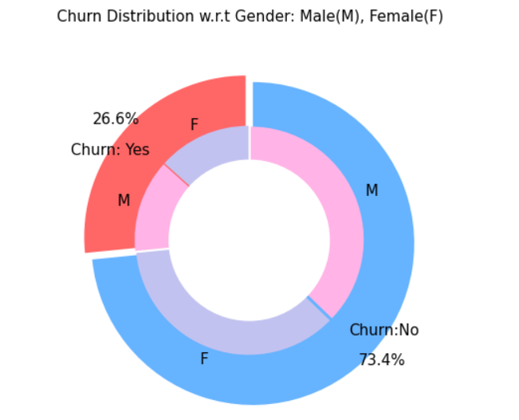
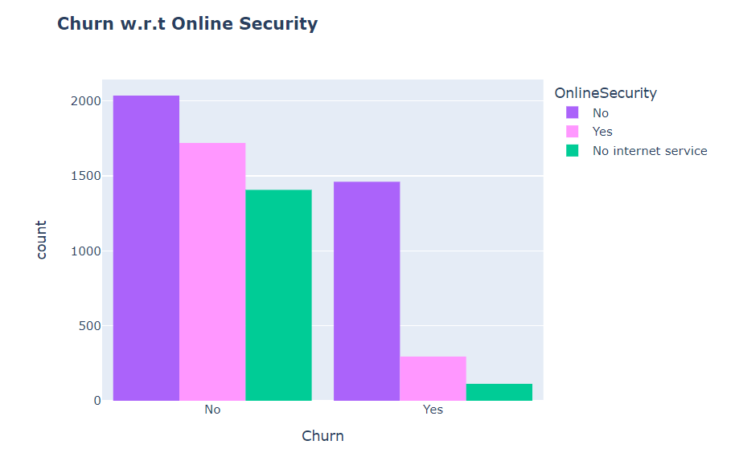
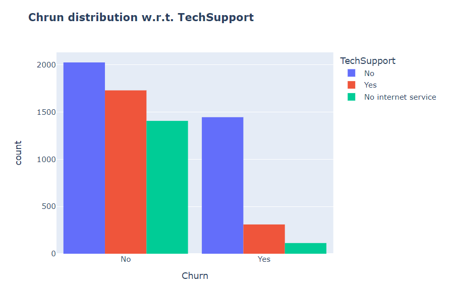
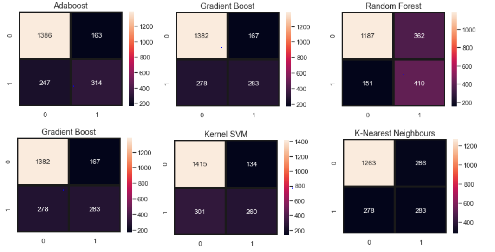

# Telecom Customer Churn Prediction


## What is Customer Churn?
Customer churn is defined as when customers or subscribers discontinue doing business with a firm or service.

Customers in the telecom industry can choose from a variety of service providers and actively switch from one to the next. The telecommunications business has an annual churn rate of 15-25 percent in this highly competitive market.

Individualized customer retention is tough because most firms have a large number of customers and can't afford to devote much time to each of them. The costs would be too great, outweighing the additional revenue. However, if a corporation could forecast which customers are likely to leave ahead of time, it could focus customer retention efforts only on these "high risk" clients. The ultimate goal is to expand its coverage area and retrieve more customers loyalty. The core to succeed in this market lies in the customer itself.

Customer churn is a critical metric because it is much less expensive to retain existing customers than it is to acquire new customers.

To detect early signs of potential churn, one must first develop a holistic view of the customers and their interactions across numerous channels. As a result, by addressing churn, these businesses may not only preserve their market position, but also grow and thrive. More customers they have in their network, the lower the cost of initiation and the larger the profit. As a result, the company's key focus for success is reducing client attrition and implementing effective retention strategy.

## Objectives
- Finding the % of Churn Customers and customers that keep in with the active services.
- Analysing the data in terms of various features responsible for customer Churn
- Finding a most suited machine learning model for correct classification of Churn and non churn customers.

## Dataset
**Telco Customer Churn**
The data set includes information about:
- Customers who left within the last month – the column is called Churn
- Services that each customer has signed up for – phone, multiple lines, internet, online security, online backup, device protection, tech support, and streaming TV and movies
- Customer account information – how long they’ve been a customer, contract, payment method, paperless billing, monthly charges, and total charges
- Demographic info about customers – gender, age range, and if they have partners and dependents

## Implementation
**Libraries:** sklearn, Matplotlib, pandas, seaborn, and NumPy

## Exploratory Data Analysis (EDA) Highlights
- **Churn distribution:** 26.6 % of customers switched to another firm.
  
- **Gender:** Both genders behaved in similar fashion when it comes to migrating to another service provider.
  
- **Contracts:** About 75% of customer with Month-to-Month Contract opted to move out as compared to 13% of customers with One Year Contract and 3% with Two Year Contract.
  
- **Payment Methods:** Major customers who moved out were having Electronic Check as Payment Method. Customers who opted for Credit-Card automatic transfer or Bank Automatic Transfer and Mailed Check as Payment Method were less likely to move out.
  
- **Internet services:** Customers who use Fiber optic have high churn rate, which might suggest a dissatisfaction with this type of internet service.
  
- **Online Security & Tech Support:** Customers churn due to lack of online security and no Tech Support.
  
  
- **Charges:** Customers with higher Monthly Charges are also more likely to churn.
  

## Machine Learning Model Evaluations
We evaluated multiple models (Logistic Regression, KNN, Naive Bayes, Decision Tree, Random Forest, AdaBoost, Gradient Boost, and a Voting Classifier) using K-fold cross validation.


### Model Comparisons
Below are the comparisons of our models based on Accuracy and ROC AUC:


### Confusion Matrices Overview


### Final Model: Voting Classifier
We selected Gradient boosting, Logistic Regression, and Adaboost for our Voting Classifier.

```python
from sklearn.ensemble import VotingClassifier
clf1 = GradientBoostingClassifier()
clf2 = LogisticRegression()
clf3 = AdaBoostClassifier()
eclf1 = VotingClassifier(estimators=[('gbc', clf1), ('lr', clf2), ('abc', clf3)], voting='soft')
eclf1.fit(X_train, y_train)
predictions = eclf1.predict(X_test)
print("Final Accuracy Score ")
print(accuracy_score(y_test, predictions))
```

**Final Score:**
- Accuracy for VotingClassifier: ~84.68% (+/- 1.08%)


## Optimizations
We could use Hyperparameter Tuning or Feature engineering methods to improve the accuracy further.

## About Me
Hi, I am **Maansi**! 👋  
I am a Data Science and Machine Learning enthusiast passionate about building predictive models and extracting actionable insights from data. I love tackling real-world problems and creating impactful projects like this Telecom Customer Churn Prediction.

Feel free to connect with me and check out my other projects!
🔗 **GitHub:** [1112005-mb](https://github.com/1112005-mb)
